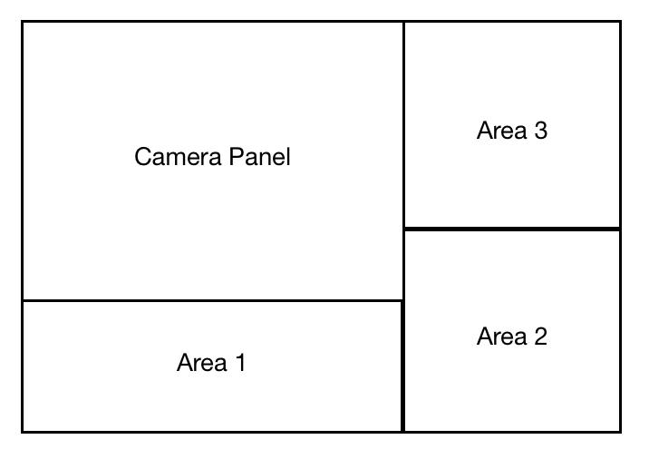

# DESIGN_PLAN

## Introduction

## Overview

## User Interface
- There will be separate windows for gaming environment and authoring environment: user will create and edit the game in authoring environment while playing the game in gaming environment.
- Inside the authoring environment, the window would be divided into three(or four) main areas. While the camera panel, where user can see and manipulate game scene and the location of GameObject, would always stay in one area, other two areas are flexible in terms of the panel they host. 
- Currently, we are planning to provide properties panel, library panel and menu panel. Properties panel would allow user to change the properties of any selected GameObject. Library panel would display default library for GameObject or library loaded by the user to the authoring environment. Visual representation of each GameObject would be shown inside this panel, and an instance of the GameObject would be added to camera panel when user clicks on it. Menu panel would provide user more options to change properties of the game. 

## Design Details

## Example Games

## Design Consideration